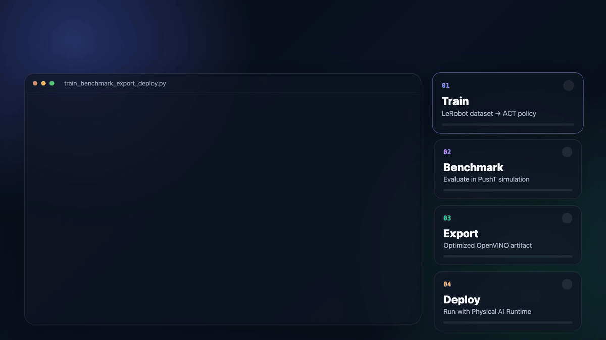
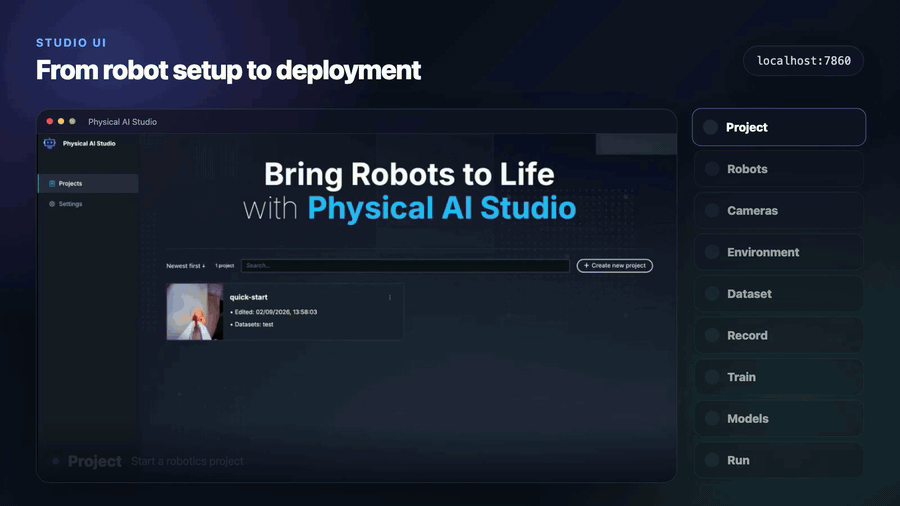
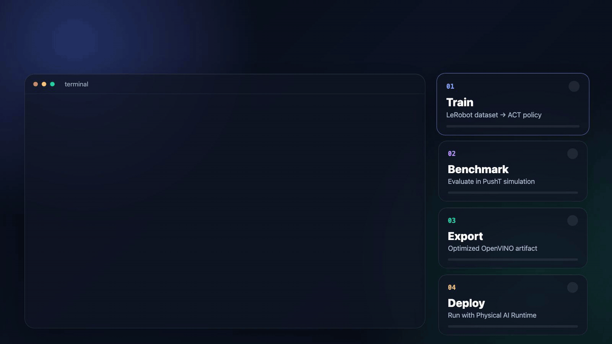
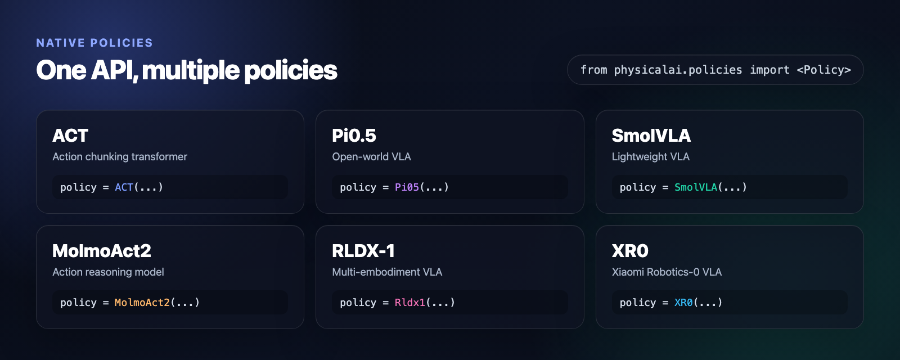
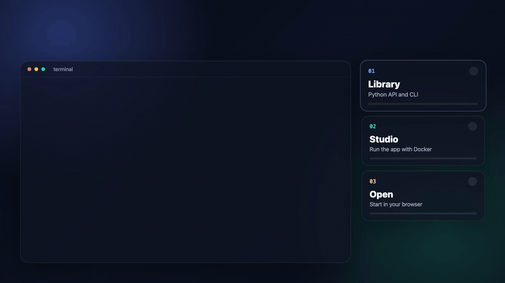
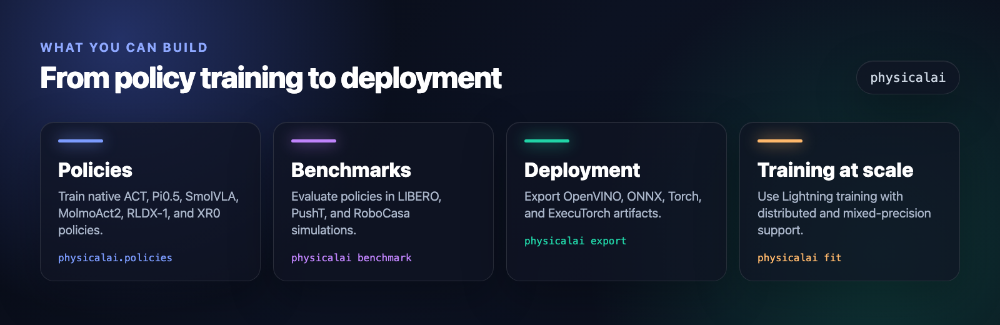
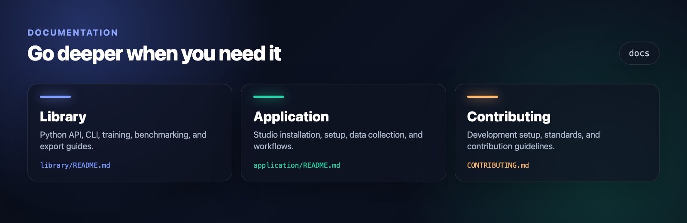

<p align="center">
  
</p>

<div align="center">

**Train, benchmark, and deploy robot policies with Python, the CLI, or a visual Studio.**

[Python API](#python-api) •
[Studio UI](#studio-ui) •
[CLI](#cli) •
[Install](#install) •
[Docs](#documentation)

</div>

---

## Python API

Train, benchmark, export, and deploy a policy from Python.

<!-- markdownlint-disable MD033 -->
<p align="center">
  
</p>
<!-- markdownlint-enable MD033 -->

<details>
<summary>Copy the example</summary>

```python test="skip" reason="requires dataset download and robot observation"
from physicalai.benchmark.gyms import PushTBenchmark
from physicalai.data import LeRobotDataModule
from physicalai.inference import InferenceModel
from physicalai.policies import ACT
from physicalai.train import Trainer

datamodule = LeRobotDataModule(repo_id="lerobot/pusht")
policy = ACT()

trainer = Trainer(max_epochs=100)
trainer.fit(model=policy, datamodule=datamodule)

benchmark = PushTBenchmark(num_episodes=50)
results = benchmark.evaluate(policy)

policy.export("./exports/act", backend="openvino")

runtime_policy = InferenceModel("./exports/act")
action = runtime_policy.select_action(observation)
```

</details>

## Studio UI

Collect demonstrations, train models, and run inference from a visual interface.

<!-- markdownlint-disable MD033 -->
<p align="center">
  
</p>
<!-- markdownlint-enable MD033 -->

## CLI

Run the same train, benchmark, export, and deploy workflow from the terminal.

<!-- markdownlint-disable MD033 -->
<p align="center">
  
</p>
<!-- markdownlint-enable MD033 -->

<details>
<summary>Copy the commands</summary>

```bash
physicalai fit --config configs/physicalai/act/pusht/default.yaml

physicalai benchmark --config configs/benchmark/pusht.yaml \
  --policy physicalai.policies.ACT \
  --ckpt_path experiments/lightning_logs/version_0/checkpoints/last.ckpt

physicalai export --policy physicalai.policies.ACT \
  --ckpt_path experiments/lightning_logs/version_0/checkpoints/last.ckpt \
  --backend openvino --output_dir exports/act

physicalai run --config robot.yaml
```

Replace `robot.yaml` with the Runtime configuration for your robot and exported policy.

</details>

## Policies

Use one API across native Physical AI Studio policies.

<!-- markdownlint-disable MD033 -->
<p align="center">
  
</p>
<!-- markdownlint-enable MD033 -->

<details>
<summary>Switch policies</summary>

```python test="skip" reason="downloads pretrained policy weights"
from physicalai.policies import ACT, MolmoAct2, Pi05, Rldx1, SmolVLA, XR0

act = ACT()
pi05 = Pi05(pretrained_name_or_path="lerobot/pi05_base")
smolvla = SmolVLA()
molmoact2 = MolmoAct2()
rldx1 = Rldx1()
xr0 = XR0()
```

</details>

## Install

Start with the library, or run the full Studio application with Docker.

<!-- markdownlint-disable MD033 -->
<p align="center">
  
</p>
<!-- markdownlint-enable MD033 -->

<details>
<summary>Copy the commands</summary>

```bash
# Python API and CLI
pip install physicalai-train

# Studio UI with Docker
git clone https://github.com/open-edge-platform/physical-ai-studio.git
cd physical-ai-studio/application/docker
cp .env.example .env
./setup-devices.sh --cpu  # or --xpu, --cuda
docker compose up -d
```

Open <http://localhost:7860>. For native development, see [Application installation](./application/docs/01-installation.md). Hugging Face–backed policies need an `HF_TOKEN`; see [Hugging Face integration](./application/backend/docs/huggingface_integration.md).

</details>

## What you can build

<!-- markdownlint-disable MD033 -->
<p align="center">
  
</p>
<!-- markdownlint-enable MD033 -->

## Documentation

<!-- markdownlint-disable MD033 -->
<p align="center">
  
</p>
<!-- markdownlint-enable MD033 -->

[Library docs](./library/README.md) • [Application docs](./application/README.md) • [Contributing](./CONTRIBUTING.md)
