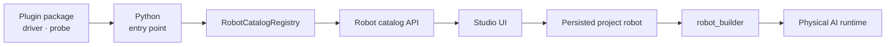
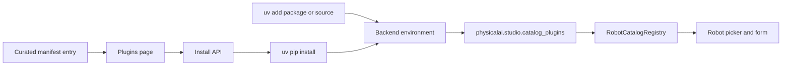
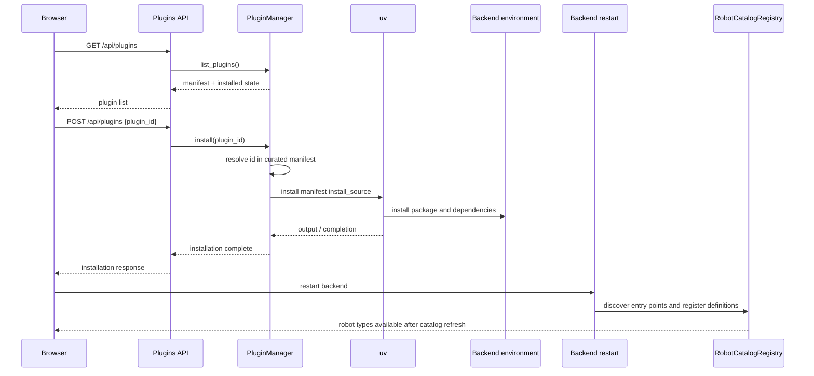
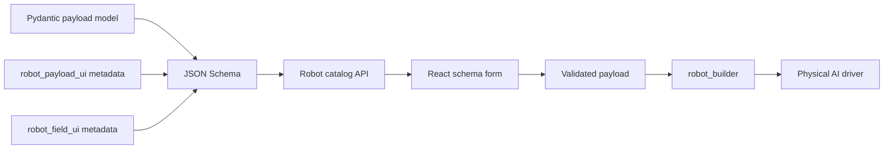

# Robot Plugin Architecture

Physical AI Studio uses Python packages to extend its robot catalog without
embedding every robot driver in Studio. A plugin owns the driver and its
connection behavior. Studio discovers plugin packages and owns persistence,
configuration forms, and runtime orchestration. Each plugin builds a
`physicalai.robot.interface.Robot` driver and is responsible for discovering
and connecting its physical devices.

For installation and plugin development instructions, see
[Robot Plugins](../robot-plugins.md). This document explains the internal
boundaries and the reasons behind them.

## Contents

- [Boundaries](#boundaries)
- [Two installation paths](#two-installation-paths)
- [Installation lifecycle](#installation-lifecycle)
- [Discovery](#discovery)
- [Catalog contract](#catalog-contract)
- [Physical AI framework use](#physical-ai-framework-use)
- [Schema-driven forms](#schema-driven-forms)
- [Runtime construction](#runtime-construction)
- [Assets](#assets)
- [Operational constraints](#operational-constraints)
- [Failure modes](#failure-modes)

## Boundaries



Plugins own:

- Physical AI robot drivers.
- Device discovery and connection details.
- Pydantic payload models.
- Catalog definitions and optional probes.
- Optional URDF and visualization assets.

Studio owns:

- The curated plugin manifest and Plugins page.
- Installation and uninstallation operations.
- Entry-point discovery and catalog registration.
- Schema-driven robot configuration forms.
- Project persistence and runtime/session integration.

The plugin boundary is deliberately Python-only. A plugin does not contribute
React code to render its form. Its Pydantic schema and presentation metadata are
translated into the existing Studio form controls.

## Two Installation Paths

Curated and unofficial plugins take different paths through installation, but
converge when Python entry points are discovered:



The manifest is a Studio-owned allowlist. It supplies metadata and an
installable source for plugins that Studio has chosen to expose in the UI. A
manual `uv add` bypasses that allowlist and is intended for development,
private integrations, and unofficial packages.

Neither path makes a new catalog definition visible to a running backend.
Entry-point discovery and the catalog's robot schemas happen during process
startup, so installation is followed by a restart.

## Installation Lifecycle



`PluginManager` does not accept an arbitrary package string from the request.
It resolves the request's identifier against the manifest and uses the matched
entry's `install_source`. This keeps the UI install operation constrained to
reviewed sources.

The manager checks installed state using
`importlib.metadata.distribution`. The Plugins page can therefore show a
manifest plugin before it is installed and show its installed version after the
distribution is present. The catalog itself is refreshed only by restarting
the backend.

## Discovery

Plugins declare the entry-point group
`physicalai.studio.catalog_plugins` in `pyproject.toml`:

```toml
[project.entry-points."physicalai.studio.catalog_plugins"]
my-robot = "physicalai_my_robot_plugin.studio_catalog:register_physicalai_studio_plugin"
```

At startup, `RobotCatalogRegistry` loads the entry points and calls each
registration function. Each plugin calls `registry.register_robot(...)` for
its definitions. The registry then supplies the catalog data used by the
robot picker and the backend robot schemas.

The manifest and entry points serve different purposes:

- The manifest describes curated packages, including packages that are not
  installed yet.
- Entry points describe definitions that are actually available in the current
  Python environment.
- The live registry can contain dynamic definitions that were not known when
  the manifest was written, as with LeRobot integrations.

## Catalog Contract

`studio_catalog.py` is a module in the plugin package that contains the
callable named by its `physicalai.studio.catalog_plugins` entry point. It is the
boundary between plugin code and Studio:

```python
def register_physicalai_studio_plugin(registry) -> None:
    registry.register_robot(
        RobotCatalogDefinition(
            type="MyRobot_Follower",
            display_name="My Robot Follower",
            role="follower",
            robot_payload=MyRobotPayload,
            robot_builder=build_my_robot,
            probe=MyRobotProbe(),
        )
    )
```

The important definition fields are:

- `type` is a stable, globally unique persisted identifier.
- `display_name` is the user-facing robot name.
- `role` distinguishes action-executing followers from teleoperation leaders.
- `robot_payload` describes configuration data and validation.
- `robot_builder` converts validated configuration into a driver.
- `probe` optionally supports discovery, identification, and online checks.
- `asset` optionally describes URDF and visualization data.

Registration failures are intentionally visible at startup. Import errors,
duplicate types, invalid payload models, or invalid form metadata prevent the
affected definition from being usable. A stable `type` is particularly
important because project rows store it and later use it to select the correct
payload and builder.

## Physical AI Framework Use

`robot_builder` returns a standard `physicalai.robot.interface.Robot` driver.
The plugin package can consequently also be installed and used directly with
the Physical AI framework; Studio only adds catalog discovery, persisted
payloads, and its configuration UI around that driver. The runtime uses the
driver's configured class path to construct the robot, so the plugin package
must be installed in the runtime environment. Update any `# CHANGE_ME` device
paths in a downloaded runtime configuration for the target machine before use.

Studio-specific pieces, such as the catalog entry point, payload form metadata,
and `RobotProbe`, are used only by Studio. They do not prevent the driver from
being used by the Physical AI Runtime.

## Schema-Driven Forms

The form pipeline has no plugin-specific frontend component:



Pydantic JSON Schema is the data contract. Field titles, descriptions, defaults,
enums, required values, and nested models are rendered by the normal schema
form. Studio-specific metadata adds presentation behavior without changing the
payload data model:

- `robot_field_ui` marks advanced configuration or applies a Studio-only
  required override.
- `robot_payload_ui` orders fields and adds `section`, `field`, `connection`,
  and `info` items.
- A `connection` item owns its bound connection and serial-number fields, so
  the raw fields are not rendered twice.
- Bindings are relative to the model that declares them. Nested payload models
  define their own connection metadata.
- Fields not explicitly placed or owned still render automatically.

This design lets a plugin provide a useful form with ordinary Pydantic fields,
while opting into first-party controls only where needed.

[//]: # "Screenshot suggestion: Robot catalog and a plugin-generated form side by side, illustrating the catalog-definition-to-form pipeline."

## Runtime Construction

After a user saves a robot:

1. Studio persists the catalog `type` and the payload data in the project.
2. The backend resolves the type through the live catalog.
3. The payload is validated against the definition's Pydantic model.
4. Studio calls `robot_builder` with the typed payload and a
   `CatalogRobotFactory`.
5. The builder resolves the configured connection and returns a Physical AI
   robot driver.
6. The driver is handed to the existing runtime/session flow.

An optional probe is used for discovery and online checks; it is separate from
the builder so catalog browsing does not have to construct a connected driver.
For the runtime after construction, see [Runtime Session Architecture](./runtime-session-architecture.md).

## Assets

`RobotAsset` is optional. When present, it describes:

- The URDF path relative to the asset root.
- Package directories containing the URDF and meshes.
- A mapping from observation keys to URDF joints.
- An optional root resolver for installed or source-tree layouts.
- Optional asset data is used by Studio's robot visualization.

An asset-less definition remains configurable and usable. It simply has no 3D
model preview. Asset paths are resolved by the backend, not by the browser's
filesystem.

## Operational Constraints

- Catalog entry points are loaded when the backend process starts.
- Installing, changing, or removing a plugin requires a backend restart.
- The manifest is source-controlled application configuration.
- Manual packages must be installed into the same Python environment used by
  the backend.
- Package dependencies must be compatible with the Studio backend's Python and
  dependency set.
- Installing packages ad hoc inside a Docker container does not survive image
  replacement or rebuilds.
- A curated manifest entry does not replace entry-point registration; both are
  needed for a plugin to be installable from the UI and usable as a robot.

[//]: # "Screenshot suggestion: Plugins page with a curated plugin selected, illustrating the manifest-backed installation path."

## Failure Modes

Failures can be diagnosed at the stage where they occur:

- **Package installation:** Check `install_source`, Python version, package
  index, and dependencies when a package cannot be resolved or built.
- **Entry-point loading:** Check the entry-point group and import path in
  `pyproject.toml` when an installed plugin is not discovered.
- **Registration:** Check the unique `type`, payload model, and
  `register_robot` call when a definition is rejected.
- **Form generation:** Check JSON Schema titles and `robot_payload_ui` field
  ownership and bindings when fields are missing or duplicated.
- **Catalog refresh:** Restart the backend when a new robot is not visible.
- **Driver construction:** Check payload values, probe, serial permissions,
  SDK, and builder when a robot cannot connect.
- **Visualization:** Check `RobotAsset` paths, package map, joint map, and root
  resolver when a URDF preview fails.

The separation is useful operationally: a package can install successfully yet
still fail at import or registration, and a valid catalog definition can still
fail later when a physical device is unavailable.
