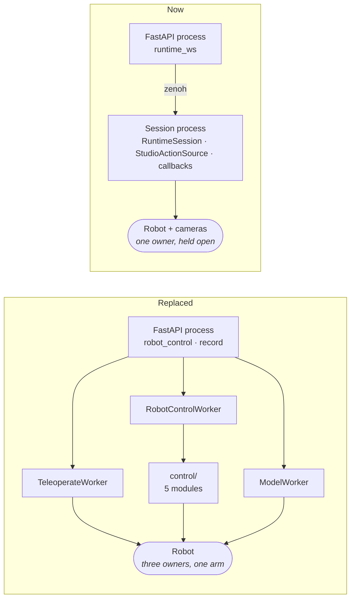
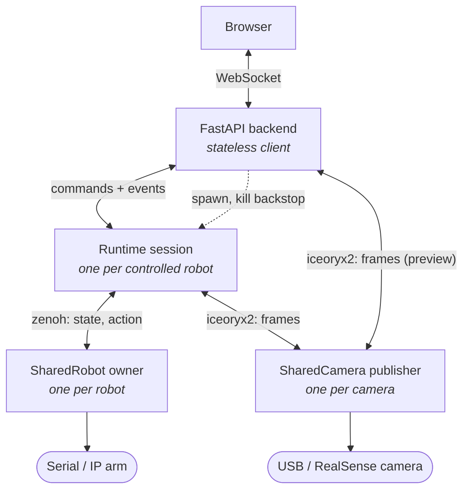
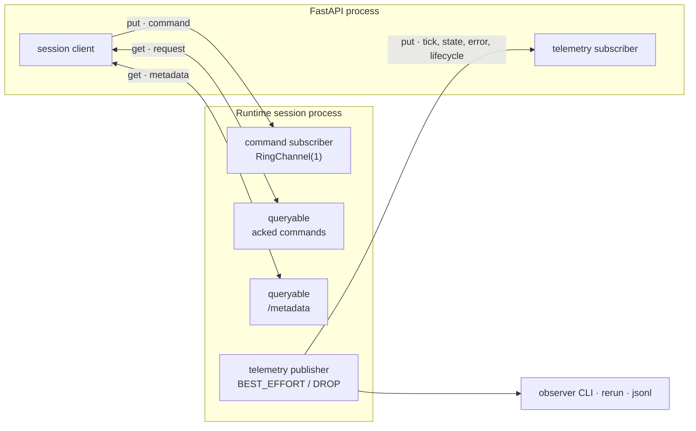
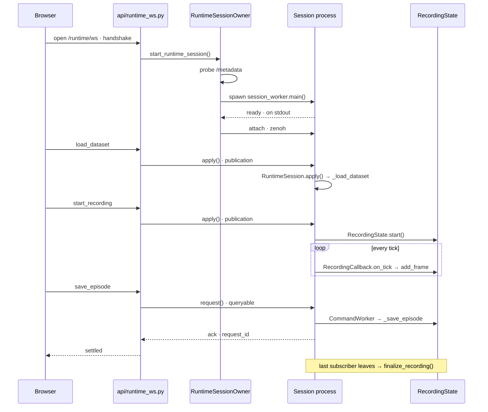
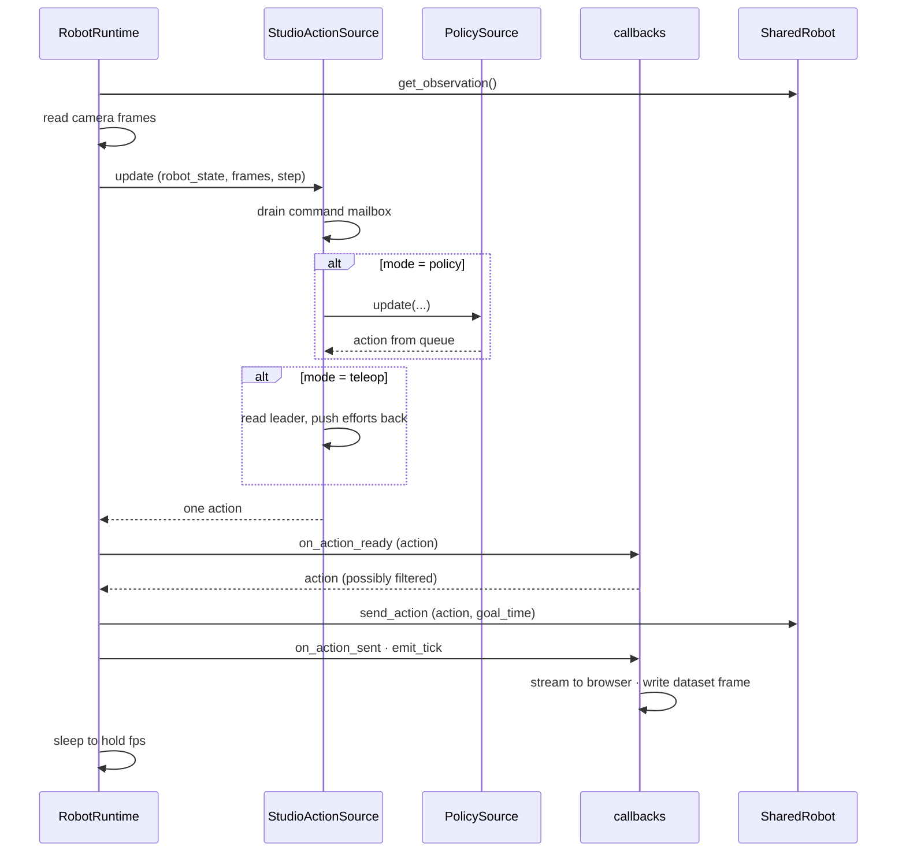
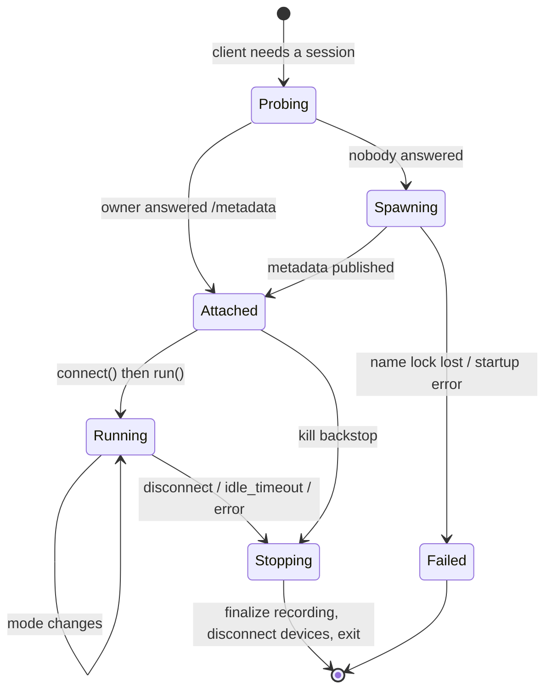

# Runtime Session Architecture

Studio drives a physical robot four ways: teleoperation by hand, running a trained policy, recording a dataset, and exporting a model that reproduces the run elsewhere. All four run on one session, a long-lived process that owns the robot and its cameras for as long as you are working with them. Each capability arrives as a command sent to that session.

This replaced two hand-written control loops (`TeleoperateWorker`, `RobotControlWorker`) and a separate model-worker process pool. Studio no longer owns loop machinery, timing, or teardown ordering. It owns three things: which action to send, what to stream to the browser, and what to write to a dataset. `physicalai.runtime.RobotRuntime` runs the loop.

This document covers the decisions and constraints you cannot read off the code, especially the traps. For what the code does, read `backend/src/runtime/`.

## Contents

- [The shape](#the-shape)
- [One request, end to end](#one-request-end-to-end)
- [One tick](#one-tick)
- [Modes](#modes)
- [Session lifecycle and ownership](#session-lifecycle-and-ownership)
- [Identity: when two sessions are the same session](#identity-when-two-sessions-are-the-same-session)
- [Exclusivity](#exclusivity)
- [Export](#export)
- [Traps](#traps)
- [Constraints](#constraints)

## The shape

### Why one session

Every capability used to get its own worker process, and each one opened the robot itself.



Three processes wanting the same arm means handing the hardware back and forth, with none of them able to see what the others are doing. A crash in any one of them took the API process down too, since they ran as threads inside it.

One session holding the robot for the length of the work removes both problems. Teleoperation, inference and recording became modes and commands on a process that already has the hardware open.

### Layered ownership

Each layer owns exactly one class of resource, and the edges name their transport.



Two things to read off this diagram. Hardware I/O already lives in its own processes: `SharedRobot` spawns an owner that holds the serial port, and `SharedCamera` spawns a publisher that holds the device. Studio inherited that when it adopted SharedRobot. The API also reaches camera frames directly without them passing through the session, so frames never cross the session boundary.

### Transport

The session runs in its own OS process. Control and telemetry go over Zenoh; frames do not.



The split mirrors what physicalai already does for robots. Commands that set desired state go out as best-effort publications, because re-sending them is harmless and only the newest matters. Commands that fire once and cannot be lost go through a queryable and get a reply.

| Idempotent (sets desired state) | Edge-triggered (needs a reply) |
| --- | --- |
| `set_follower_source`, `load_model`, `load_dataset`, `start_task`, `stop_task`, `start_recording`, `disconnect` | `save_episode`, `discard_episode` |

Losing a `save_episode` loses an episode someone recorded, which is why those two are the exception.

A `/metadata` queryable answers "is there a session for this robot, and what is it doing", which is what makes discovery and reattach work. Telemetry is best-effort with drop-on-congestion, so a slow consumer degrades to a lower frame rate instead of stalling the control loop. It is a publication rather than a pipe, so an observer CLI or a Rerun viewer can attach to a live session without the session knowing.

### Session names

Zenoh keys look like `studio/rt/rt-<follower-uuid>/…` (`runtime/transport/ids.py`).

The `rt-` prefix keeps a session's name clear of the robot's. Without it a session would be named after the follower UUID, which `SharedRobot` already claims through `SharedRobot.from_config(name=...)`. Upstream turns that name into two things and namespaces neither:

- a lock file at `sha256(f"name:{identity}")`
- a rendezvous port from `physicalai/robot/{name}`

A session sharing the name grabs the lock the robot's owner needs and binds the port it listens on, so the owner dies at startup with `name_lock_contention` while the session waits for a robot nobody started.

Studio separates them three ways:

- The name carries the `rt-` prefix, checked by `_SESSION_NAME_RE`. Upstream's `validate_name` allows letters, digits, `_` and `-`, so it passes.
- `derive_endpoint_port` hashes into 10000–19999. Physicalai robots use 20000–59999.
- The lock hashes `f"{SESSION_LOCK_KIND}:{identity}"`, which changes the kind as well as the identity. Upstream's `_lock.py` is private, so Studio carries its own copy.

## One request, end to end

Recording one episode is the clearest single path through the architecture, because it touches every layer: the socket, the spawn, the wire, the control loop, and the dataset.



1. The browser opens the runtime socket. The handshake names the follower, the leader, and the
   camera ids; the API resolves each against the project before anything is spawned.
2. `start_runtime_session` hands off to `RuntimeSessionOwner`, which probes `/metadata` and either
   attaches to a live session or spawns one. See
   [Identity](#identity-when-two-sessions-are-the-same-session) for how it decides.
3. `RuntimeProcessHost.start()` spawns `session_worker.main()`. Readiness crosses two channels: the
   child reports ready on its stdout before Zenoh is up, and only then does the client attach over
   the wire.
4. `load_dataset` reaches `handle_incoming`, which validates the payload and forwards it.
5. `RuntimeSessionClient.apply()` publishes it. `RuntimeZenohServer` pumps it into
   `RuntimeSession.apply()`, which opens the dataset in `_load_dataset`.
6. `start_recording` arms recording. `StudioActionSource` handles it rather than the session
   directly, because recording has to line up with the control loop.
7. Every tick, `RecordingCallback.on_tick` appends one observation-and-action pair through
   `RecordingState.add_frame`.
8. `save_episode` shows the two command classes in action. It travels through the queryable as a
   request and comes back as an ack carrying its `request_id`, so the browser learns whether the
   write succeeded. `load_dataset` and `start_recording` above are fire-and-forget.
9. The write itself runs on `CommandWorker`, off the control thread, because it encodes video.
10. When the last subscriber leaves, `finalize_recording()` is queued and the cache is copied back
    into the dataset, so the episode does not wait for process exit.

## One tick

The upstream loop calls into Studio's code at three points.



Two consequences. Commands drain at the top of `update()` before the action is decided, so a mode change takes effect on the tick it arrives. The recording callback also sees `TickEvent`, which carries the observation and the action that was sent, so recording never reads the robot separately.

## Modes

Teleoperation and policy execution are modes of one session. `StudioActionSource` implements the upstream `ActionSource` protocol and picks between them.

| Mode | Action sent |
| --- | --- |
| `hold` | a target latched when the mode was entered |
| `teleop` | leader joint positions, plus efforts to the leader |
| `policy` | next action from `PolicySource` |

`hold` exists because `ActionSource.update()` must return an action every tick. The protocol has no way to send nothing.

**`hold` latches its target on entry and resends that same value.** Sending the freshly measured position each tick makes the arm sag. Measured position trails the commanded target by the servo's steady-state error, so feeding it back integrates that error downward under gravity. The latch is copied once, returned as a copy each tick, and cleared on a mode change.

**A policy failure drops to `hold` with a fresh latch** instead of stopping the loop. The arm holds where it is and the session stays alive to report the error.

### Modes rather than session types

The delegates are live simultaneously, and the mode selects whose output wins:

```python
policy_action = self._policy.update(...) if self._policy else None
leader_action = self._read_leader(robot_state) if self._leader else None
return self._arbitrate(mode, policy_action, leader_action, robot_state)
```

The alternative forecloses human-in-the-loop by leaving the policy idle and its queue stale:

```python
match mode:
    case "teleop": return self._leader_action(robot_state)
    case "policy": return self._policy.update(...)
```

Human-in-the-loop puts a person and a policy in control during the same episode, which two session types cannot express. Committing to modes now makes HIL an arbitration change later instead of a restructuring. Nothing implements it yet, and `FollowerSource` is `hold | teleop | policy`. Adding it would not change the shape.

Both delegates are optional. Dataset recording runs with no model loaded, so `policy_action is None` happens routinely.

## Session lifecycle and ownership

### The session owns devices; the runtime is a view

The runtime's `robot`, `cameras`, `fps` and `callbacks` are fixed at construction. That does not block reconfiguration, because of two properties:

- `run()` returning does **not** disconnect devices. Device teardown lives in `RobotRuntime.disconnect()`, reachable only through `__exit__` or an explicit call.
- Every `connect()` in the chain is idempotent. `RobotRuntime.connect()` guards on its own flag; `SharedRobot.connect()` and `SharedCamera.connect()` return early when already connected.

The session therefore holds the device objects and treats the runtime as disposable:

```text
RuntimeSession  (long-lived)
├── owns    SharedRobot, dict[name, SharedCamera]     survive rebuilds
├── owns    StudioActionSource, callbacks
└── holds   current RobotRuntime                      rebuilt on rig change
```

Swapping a camera means: stop the run, mutate the device dict, construct a new `RobotRuntime` over it, run again. Surviving devices are never disconnected, so no owner process restarts and the follower never drops torque.

Devices **preconnect in parallel** during setup, one thread per device, because serial and camera opens are independent and each costs real wall time.

### Work that must not run on the control loop

Three things run off the control thread, each for a different reason:

| What | Where | Why |
| --- | --- | --- |
| `save_episode`, `discard_episode`, dataset copy-back | `CommandWorker`, one serialized thread | They write parquet and encode video. Serialized because ordering matters: a save then a discard must not interleave. |
| Model loading | `PolicyLoader`, its own thread | So a dataset copy cannot sit in front of a model load. Handover is by generation number, and a load that finishes too late is dropped. |
| Per-frame image writes | lerobot's own writer threads | Already threaded upstream. `RecordingCallback` stays synchronous so it keeps ordering against save and discard. |

The control loop itself does the frame copy and appends to the episode buffer. Video encoding happens at `save_episode`, in a process pool.

### Start and stop



**Start** follows `SharedRobot.connect()`: probe `/metadata`, spawn if nobody answers, resolve the spawn race with a name lock and re-probe. Idempotent, and reattach comes free. `Probing` before `Spawning` is what gives reattach, so a page refresh finds the existing session instead of fighting it.

Readiness crosses two channels. The child reports ready on its **stdout** before Zenoh is up, then the client attaches over the wire.

**Stop** has three paths, all required:

1. **Explicit.** The user disconnects. Stop the run, finalize recording, disconnect devices, exit.
2. **Idle self-exit.** No subscriber present for `idle_timeout`. This covers an API crash, a closed browser, and a dropped network. It is a safety property. An abandoned session in hold mode keeps commanding a latched target with torque on and nobody watching.
3. **Kill backstop.** The API is the parent process, so it can terminate a wedged session. Control over Zenoh buys reattach; being the parent buys "die now regardless of internal state".

**Recording finalizes when the last subscriber leaves.** The process stays alive for the idle window, so a returning client keeps the hardware connection. The dataset must not wait that long: the user navigates straight back to the dataset page expecting their episodes. The arm latches to `hold` first, then the recording commits.

**The idle timeout is 45 seconds, as a setting** (`RUNTIME_IDLE_TIMEOUT_S`). A websocket reconnect after a page refresh completes well under 5 seconds, so 45 leaves roughly nine times the headroom for a slow reload or a brief network drop. At the other end it bounds an abandoned, torque-holding arm to under a minute. It runs much longer than `SharedRobot`'s 10-second owner default, because that timeout only costs a process respawn while this one can cost a recording session. Hardware labs on flaky networks will want it longer, and an unattended rig will want it shorter.

On shutdown, leave follower torque enabled. SO101 holds position rather than dropping under gravity.

## Identity: when two sessions are the same session

A client asking for a session gets one of three answers: attach to what is running, restart it, or refuse. Two separate questions decide which.

- **`runtime_identity_digest`** covers the hardware: robot recipe, leader recipe, fps. Cameras are excluded.
- **`runtime_camera_keys`** covers which cameras the session has.

The check runs in that order:

1. **Different identity, refuse** with `423 Busy`, naming the holder. A client asking for a different arm must never take one over.
2. **Same identity, missing a camera, restart.** The check asks whether the running session's cameras cover what the client needs, so a session with extra cameras is still a valid attach target. Only a missing camera forces a restart, and the displaced client reattaches to the superset because its identity still matches.
3. **Otherwise, attach.**

Cameras sit outside identity because they are read-only observation. Folding them in makes every camera edit in the environment form look like a rig change, so a healthy session gets killed and respawned for something that did not affect the arm. Order matters for the same reason in reverse: checking cameras first would let a client wanting a different arm silently take over a session because it also happened to need another camera.

A rig change while recording is rejected. Changing the camera set mid-episode corrupts the dataset.

## Exclusivity

Two resources, two different answers.

**The robot is exclusive.** Two sessions must not command one follower. Both would attach as subscribers to the same owner, whose action channel is latest-wins, so their command streams would interleave on one arm. The session name enforces it: only one session can hold a given name, so a second session for the same follower cannot come into existence.

**Cameras are shared, but their settings are not.** One publisher per physical camera serves many subscribers by design. The conflict is configuration. A session connecting with `overwrite_settings=True` and a different resolution reconfigures the publisher, and every other subscriber's frames change underneath it. `validate_on_connect` checks only at connect, not continuously.

The fix is a **camera claim registry** keyed by fingerprint. The first claimant pins the settings, and a later session asking for different settings is rejected with an error naming the conflicting project. Recording holds a claim like anything else, without a separate mechanism.

Sessions connect to cameras strictly, with `overwrite_settings=False` and `validate_on_connect=True`. A session never reconfigures another session's publisher. If a camera delivers a resolution the environment did not declare, the session fails instead of reading the wrong size, because wrong pixel dimensions look fine and give a wrong answer.

### The two guards persist differently, on purpose

| Guard | Storage | Why |
| --- | --- | --- |
| Camera claims | in-memory, per API process | A claim only protects against concurrent misconfiguration inside one API process. |
| Robot holder | on-disk lock, read first | A detached session keeps driving the arm across an API restart, so this one must survive it. |

Deleting a robot, camera, or environment that is in use is rejected with the holder named. Robot deletion reads the on-disk lock registry first and only probes `/metadata` on a hit. A miss is the common case and must not open a Zenoh session. An in-memory registry would forget everything on restart and let a delete succeed while a live session is still driving the arm.

**A live lock with a metadata miss still counts as held.** The worker can hold the flock and the arm before `/metadata` answers, so a probe timeout must not be read as an idle robot.

## Export

One builder, two consumers. Studio builds its own session from the same document it exports, so the two cannot drift.

```text
        build_runtime_config(environment, model?, device?, task?, fps)
                              │
        ┌─────────────────────┴─────────────────────┐
   export bundle                              Studio session
   action_source:                             action_source: StudioActionSource{
     PolicySource{model, execution, task}       policy = PolicySource{same fragment},
     or                                     leader = same leader fragment }
     TeleopSource{leader}
   robot / cameras / fps ──── identical fragments ──── robot / cameras / fps
```

Only the wrapper differs. The robot recipe, calibration, camera recipes, fps, model path, device, execution strategy and task are all shared, so none of them can drift. The export leaves out the multiplexer, since `hold` and mode switching have no meaning in a headless run.

The builder reads Studio's database, never a live runtime, so reconfiguration needs no special handling. Swap a camera and both the export and the rebuilt session read the same updated environment. It assembles plain data instead of calling `to_config()` on a live runtime, because `InferenceModel.__init__` loads weights and `StudioActionSource` is not config-exportable.

### Bundle

```text
studio-runtime-<name>-<timestamp>.zip
├── runtime.yaml        self-contained config, relative model path
├── exports/<backend>/  model artifacts
└── README.md           the exact physicalai run command, and the CHANGE_ME list
```

Self-contained: **SO101 calibration travels inside the YAML.** `SO101Calibration.to_config_value()` emits the LeRobot calibration mapping as a plain dict, and `SO101.__init__` accepts it inline. Nothing depends on machine-local paths under `~/.local/share`. Same for fps, role, unit, baudrate, camera dimensions and frame rate.

Machine-specific, and flagged with `CHANGE_ME` in the emitted file:

- **`SO101.port`.** Studio stores pyserial's `port.device`, something like `/dev/ttyACM0`, which depends on enumeration order and shifts across reboots. The builder resolves a `/dev/serial/by-id/...` path where possible and falls back to the raw port with a marker.
- **Camera `device`.** Same treatment, using `/dev/v4l/by-id/...`.
- **`SharedRobot.name`.** Portable, but it derives the Zenoh port, so two bundles sharing a name collide on one host. That collision is the intended lock behaviour and belongs in the README.

## Traps

Each of these has cost someone time.

- **Never use `with runtime:`.** `__exit__` disconnects devices, which is what a rebuild must avoid. Call `connect()` explicitly and tear devices down at the session level.
- **`StudioActionSource.disconnect()` must not disconnect the leader.** The session owns it. Upstream's `TeleopSource.disconnect()` does disconnect its leader, so read that class for reference and do not subclass it.
- **Treat `stop()` then `run()` as a session boundary.** Every `run()` ends by calling `_bus.close()`, which closes every callback. Stateful callbacks do not survive a second run: `JsonlCallback` writes to a closed file and logs a traceback every tick, while `AsyncCallback` joins its worker with no restart path and loses telemetry silently.
- **`hold` must latch.** Resending the measured position sags the arm. See [Modes](#modes).
- **Camera feature keys must match the dataset the model was trained on**, which is not always the current environment's camera names. They diverge the moment someone renames a camera between recording and inference. `InferenceModel._prepare_inputs` raises `KeyError` on a missing input, so inference stops at the first tick. The error names the missing key and leaves you to work out why.
- **Model input collapses to a bare `images` key when there is exactly one camera**, discarding the name. With two or more it emits `images.<name>`. Single-camera setups are therefore insensitive to naming, and multi-camera setups are not.
- **The browser addresses camera panels by `camera.id`, not by feature key.** Any stream payload carrying per-camera values needs a name-to-UUID mapping alongside it.
- **Fingerprints must be canonicalized consistently.** The runtime config strips the legacy `/dev/video0:0` suffix to `/dev/video0` before opening the device. Anything keyed on a fingerprint, claims especially, must use the same canonical form. Otherwise one physical device gets two keys and the lock stops holding.

### Dataset frames are RGB end to end

This is invisible in the code and easy to break by "fixing" it. The path is RGB at every step: `SharedCamera(color_mode=ColorMode.RGB)`, no conversion on the recording path, lerobot's `RGBEncoderConfig` and `rgb24` decode, and no channel swap anywhere in `physicalai.data` or `physicalai.policies`. `PolicySource._to_model_input` performs no swap either.

The backend does one RGB→BGR conversion, in the episode thumbnail immediately before `cv2.imencode`. That one is correct because the stored frame is RGB. Thumbnails are the check: if stored frames were BGR they would come out double-swapped and visibly wrong.

## Constraints

- **One follower per session.** `RobotRuntime` takes a single robot. Bimanual arms are a single robot type, so this is not a limitation today. Two independent arms in one environment would need two sessions.
- **fps is 30** (`RUNTIME_FPS`). Dataset metadata records it, so an exported config emits the same value recording used.
- **No database access in the session.** `RobotCatalogRegistry` holds builder, probe and resolver callables, pydantic classes generated by `create_model`, and a `TypeAdapter`. None of that pickles under `spawn`. The API resolves rows and sends plain data; the session builds its own factory during setup and touches only the filesystem for the dataset. This mirrors `SharedRobot.from_config`, which ships a recipe and lets the owner rebuild the driver.
- **A session process pays spawn plus imports before its first tick.** The old `ModelWorkerRegistry` pre-spawned, which only hid process creation. `load_inference_model` still ran on demand inside it, and that is the multi-second part. If the median time from `load_model` to first policy action exceeds **10 seconds**, build a warm session-process pool. Otherwise accept it.
- **HIL sessions have no headless equivalent.** `physicalai run` takes one action source and there is no operator in it. An exported HIL session describes the policy alone. That is the right output, though it means no round-trip fidelity.
