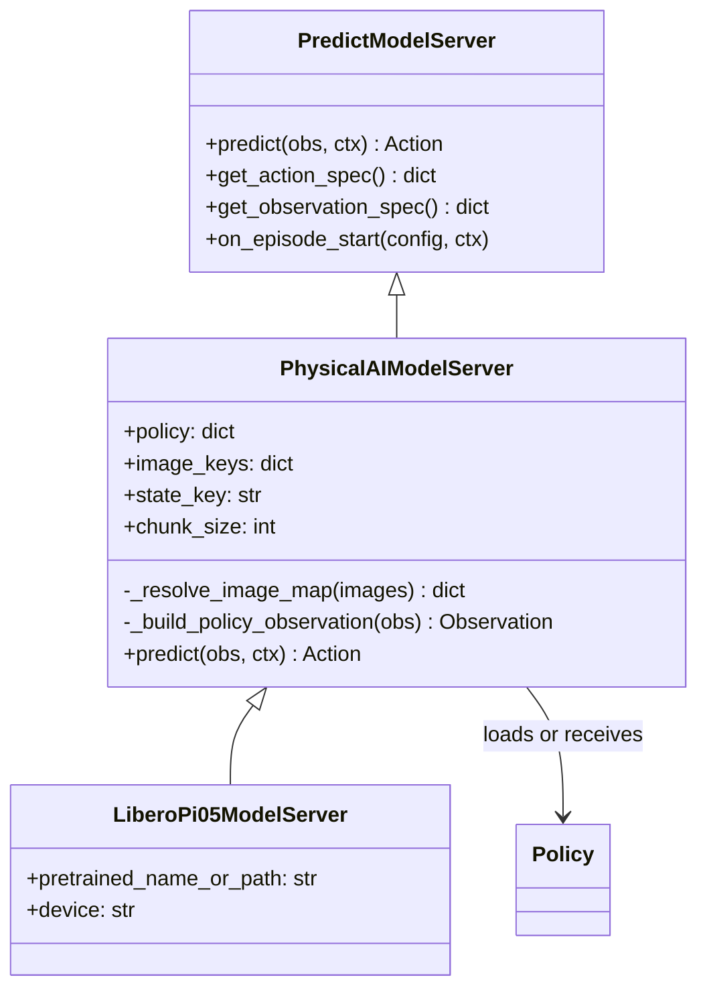
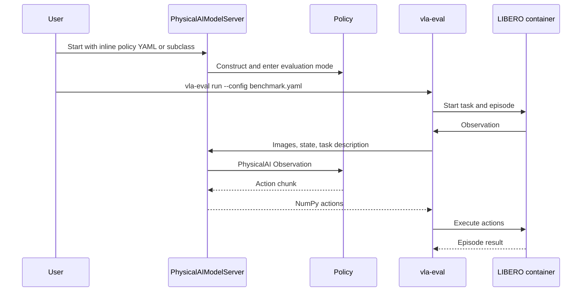

# VLA Evaluation Harness Integration

Physical AI Studio integrates with AllenAI's
[`vla-evaluation-harness`](https://github.com/allenai/vla-evaluation-harness)
through model servers. The model server runs in the Physical AI Studio
environment while the harness runs benchmark simulators in isolated
environments. Pi0.5 on LIBERO is the reference integration.

The adapter lives in `benchmarks/vla-evaluation-harness/`, outside the
`physicalai` package. This keeps external harness and simulator dependencies
out of the public package API.

## Integration Structure



`PhysicalAIModelServer` owns the reusable protocol bridge and is the supported
Pi0.5 integration path. An optional benchmark-specific server such as
`LiberoPi05ModelServer` only owns policy construction and stable defaults for a
model-benchmark pair.

Class names follow vla-eval conventions: package adapters use
`{Package}ModelServer`, while benchmark-specific adapters use
`{Benchmark}{Model}ModelServer`. Since these files already live under
`model_servers/`, their filenames are simply `physicalai.py` and
`libero_pi05.py`.

## Implementation

### PhysicalAIModelServer

`PhysicalAIModelServer` adapts a `physicalai.policies.Policy` or exported
`physicalai.inference.InferenceModel` to the `PredictModelServer` interface.
The target configuration API accepts the policy declaration inline so one YAML
describes the complete model server:

```python
class PhysicalAIModelServer(PredictModelServer):
    def __init__(
        self,
        policy: dict[str, Any] | None = None,
        image_keys: dict[str, str] | None = None,
        state_key: str | None = "state",
        device: str | None = None,
        *,
        chunk_size: int | None = None,
        _policy: Policy | InferenceModel | None = None,
        **kwargs: Any,
    ) -> None: ...
```

There are two construction paths:

- **Configuration path:** `policy` contains a `class_path` and `init_args`
  declaration that `jsonargparse` validates and instantiates.
- **Python path:** `_policy` accepts an already constructed policy from a
  benchmark-specific subclass.

Exactly one path is required. The inline path intentionally avoids inheriting
or referencing a second policy YAML.

The model server owns five pieces of shared behavior:

1. **Policy lifecycle:** Instantiate the policy, move live `Policy` instances
   to the requested device, enter evaluation mode, and reset state between
   episodes.
2. **Observation mapping:** Map benchmark camera names to policy feature keys
   and construct `physicalai.data.Observation`.
3. **Image layout:** Convert `(H, W, C)` uint8 images to `(B, C, H, W)` float32
   for live policies. Preserve `(B, H, W, C)` uint8 for exported pipelines
   that own preprocessing.
4. **Prediction:** Call `predict_action_chunk`, normalize the result to a
   NumPy action array, and remove a single leading batch dimension.
5. **Protocol declaration:** Report observation requirements and action specs
   before evaluation begins.

The data boundary is intentionally narrow:

```python
def predict(self, obs: Observation, ctx: SessionContext) -> Action:
    policy_obs = self._build_policy_observation(obs)
    actions = self._policy.predict_action_chunk(policy_obs)
    return {"actions": np.asarray(actions, dtype=np.float32)}
```

The implementation additionally handles policy type, device placement,
dictionary outputs, and batch dimensions.

### Benchmark-Specific Servers

Add a subclass when a model-benchmark pair needs custom loading,
preprocessing, protocol behavior, or maintained defaults. The subclass should
construct the policy and delegate shared behavior to `PhysicalAIModelServer`:

```python
class LiberoPi05ModelServer(PhysicalAIModelServer):
    def __init__(
      self,
      pretrained_name_or_path: str = "lerobot/pi05_libero_finetuned",
      device: str = "cuda",
      **kwargs: Any) -> None:
        policy = Pi05(pretrained_name_or_path=pretrained_name_or_path)
        super().__init__(
            _policy=policy,
            image_keys={"agentview": "image", "wrist": "image2"},
            state_key="observation.state",
            chunk_size=10,
            device=device,
            **kwargs,
        )
```

Prediction, specs, observation conversion, and episode reset behavior remain
on the base model server unless the external protocol itself differs.

## Key Features

### 1. Environment Isolation

The model server runs with the policy dependencies. `vla-eval` manages the
benchmark and normally runs the simulator in Docker. The processes exchange
observations and actions over WebSocket.

### 2. Configuration-First Integration

The general server is preferred when policy loading, camera mapping, state
mapping, device placement, and action chunking can be expressed in YAML. This
avoids creating a Python server for every checkpoint.

### 3. Python Extension Point

Small subclasses provide an escape hatch for custom model construction or
benchmark behavior without duplicating the model-server protocol.

### 4. Repository-Owned Configs

The installed `vla-eval` distribution supplies the CLI and benchmark
implementations, but it does not provide a stable package path to the upstream
repository's example YAML files. Physical AI Studio owns every YAML referenced
by this integration:

```text
benchmarks/vla-evaluation-harness/
├── configs/
│   ├── physicalai_pi05_libero.yaml
│   ├── physicalai_pi05_libero_openvino.yaml
│   ├── physicalai_pi05_libero_torch.yaml
│   └── benchmarks/
│       └── libero/
│           ├── smoke_test.yaml
│           ├── 10.yaml
│           └── libero.yaml
├── shard.sh
└── model_servers/
   ├── physicalai.py
   └── libero_pi05.py
```

Model-server configs construct and map the policy. Benchmark-run configs
select tasks, episode counts, recording, and output behavior. An editable
`.venv` may expose YAMLs from a source checkout, but those files are not part
of the installed package and are not a supported config source.

## Configuration Flow



## User Workflow

1. **Choose a model:** Select a Physical AI policy, such as Pi0.5.
2. **Find compatible weights:** Identify the benchmark targeted by the
   checkpoint. For example, `lerobot/pi05_libero_finetuned` targets
   LIBERO.
3. **Select the benchmark:** Confirm that `vla-eval` supports it and choose the
   repository-owned run config.
4. **Choose the integration path:** Use `PhysicalAIModelServer` with YAML for
   the standard interface, or add a small subclass for custom behavior.
5. **Smoke test, then evaluate:** Validate connectivity and data mapping before
   running the full benchmark suite.

## Benefits

1. **Dependency separation:** Simulator requirements do not enter the
   `physicalai` package environment.
2. **Reusable bridge:** Observation conversion and action protocol behavior
   are implemented once.
3. **Reproducible runs:** Model and benchmark configs are versioned with the
   integration.
4. **Extensibility:** New policies usually need YAML; unusual policies need a
   small subclass.
5. **Early validation:** Observation and action specs catch integration errors
   before long evaluation runs.

## Example Usage

### Installation

```bash
cd library
uv sync --extra cu128 --extra pi05
uv pip install vla-eval
```

Use the backend extra appropriate for the machine. Docker is required for
benchmarks that run their simulator in a container.

### General Server

```yaml
script: model_servers/physicalai.py
port: 8000
args:
  policy:
    class_path: physicalai.policies.pi05.Pi05
    init_args:
      pretrained_name_or_path: lerobot/pi05_libero_finetuned
  image_keys:
    agentview: image
    wrist: image2
  state_key: observation.state
  chunk_size: 10
  device: cuda
```

```bash
cd library/benchmarks/vla-evaluation-harness
python model_servers/physicalai.py \
   --config configs/physicalai_pi05_libero.yaml
```

### Optional Benchmark-Specific Server

```bash
cd library/benchmarks/vla-evaluation-harness
python model_servers/libero_pi05.py --port 8000
```

### Run LIBERO

In a second terminal, smoke-test one episode:

```bash
cd library/benchmarks/vla-evaluation-harness
uv run --no-sync vla-eval run \
   --config configs/benchmarks/libero/smoke_test.yaml
```

Then run the complete standard protocol: four suites, 40 tasks, and 2,000
episodes.

```bash
uv run --no-sync vla-eval run \
   --config configs/benchmarks/libero/libero.yaml
```

To distribute the same protocol across four simulator processes and merge the
shared recording afterward:

```bash
./shard.sh \
   --config configs/benchmarks/libero/libero.yaml \
   --shards 4 \
   --output-dir results/pi05-pytorch-libero
```

Sharding parallelizes simulator episodes. The Physical AI adapter currently
implements `predict()` rather than `predict_batch()`, so the shared model
server can become the bottleneck and speedup must be measured end to end.

## Integration Points

The adapter integrates with:

- **Physical AI policies** through `Policy.predict_action_chunk`
- **Exported models** through `InferenceModel.predict_action_chunk`
- **vla-eval** through `PredictModelServer`
- **Benchmark simulators** through the vla-eval orchestrator and containers
- **jsonargparse** through inline `class_path` and `init_args` declarations

This design keeps external benchmark integrations lightweight while retaining
the Physical AI policy interface and configuration conventions.
