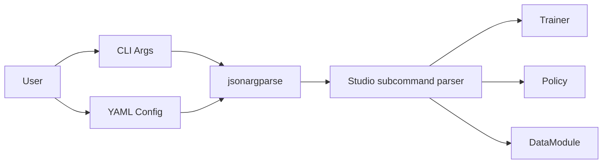

# CLI Design Documentation

Documentation for the PhysicalAI command-line interface implementation.

## Overview

The CLI module provides a powerful, flexible interface for training
policies using jsonargparse parsers registered into the shared `physicalai` host.

## Documentation Structure

1. **[Overview](overview.md)** - High-level CLI architecture and design
   philosophy
2. **[Subcommand Integration](lightning_cli.md)** - Details on the studio
   subcommands, entry points, and configuration flow

## Key Features

- **Multiple Configuration Patterns**: YAML/JSON files, CLI arguments, type validation
- **Dynamic Class Instantiation**: `class_path` pattern for flexible component loading
- **Lightning Ecosystem**: Full integration with trainer, callbacks, loggers, and plugins
- **Type Safety**: Automatic validation from type hints
- **Easy to Use**: Simple commands with powerful override capabilities

## Quick Links

- [Configuration Examples](../../../../configs/) - Example YAML configurations
- [Config System Design](../config/overview.md) - Configuration system details

## Example Usage

```bash
# Train with config file
physicalai fit --config configs/train.yaml

# Override parameters
physicalai fit --config configs/train.yaml --trainer.max_epochs 200

# Generate config template
physicalai fit --print_config
```

## Architecture Diagram



The studio CLI acts as a thin orchestration layer. The runtime package owns the
top-level `physicalai` binary, and studio contributes `fit`, `validate`, `test`,
`predict`, and `benchmark` via entry points.
