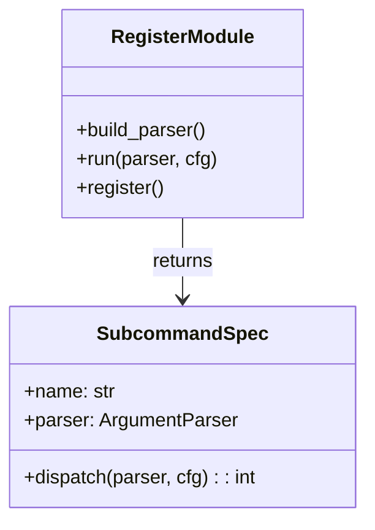
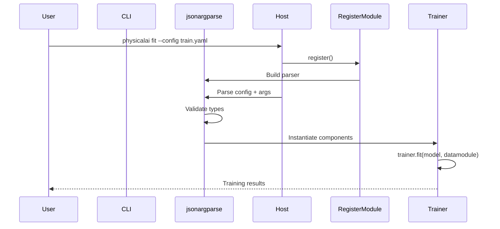

# jsonargparse Subcommand Integration

The PhysicalAI training CLI uses standalone `jsonargparse` parsers registered in
the `physicalai.cli.subcommands` entry-point group. The runtime distribution owns
the top-level `physicalai` executable and dispatches to these studio parsers on demand.

## Registration Structure



## Implementation

Each studio subcommand follows the same shape as the runtime `run` command:

```python
from jsonargparse import ArgumentParser
from physicalai.cli._spec import SubcommandSpec

def build_parser() -> ArgumentParser: ...

def run(parser: ArgumentParser, cfg) -> int: ...

def register() -> SubcommandSpec:
    return SubcommandSpec(name="fit", parser=build_parser(), dispatch=run, help="Train a model.")
```

## Key Features

### 1. Subclass Arguments

Studio parsers add subclass arguments directly for policies, datamodules, and benchmarks:

```yaml
model:
  class_path: physicalai.policies.dummy.policy.Dummy
  init_args:
    model:
      class_path: physicalai.policies.dummy.model.Dummy
```

### 2. Configuration Parsing

`jsonargparse` automatically:

- Parses YAML/JSON configuration files
- Validates types against class signatures
- Merges CLI arguments with config files
- Supports nested configuration structures

### 3. Command Support

The shared host exposes these studio commands:

```bash
physicalai fit          # Train model
physicalai validate     # Run validation
physicalai test         # Run testing
physicalai predict      # Run predictions
```

## Configuration Flow



## Benefits

1. **Shared Host**: Runtime and studio coexist under one `physicalai` executable
2. **Type Safety**: Automatic validation from type hints
3. **Ecosystem Integration**: Works with all Lightning features (callbacks,
   loggers, plugins)
4. **Maintainability**: Each subcommand is a small module with explicit wiring
5. **Extensibility**: Easy to add new commands and options

## Example Usage

### Basic Training

```bash
physicalai fit \
    --model.class_path physicalai.policies.dummy.policy.Dummy \
    --data.class_path physicalai.data.lerobot.LeRobotDataModule \
    --trainer.max_epochs 100
```

### With Config File

```bash
physicalai fit --config configs/train.yaml
```

### Override Config Values

```bash
physicalai fit \
    --config configs/train.yaml \
    --trainer.max_epochs 200 \
    --data.train_batch_size 64
```

### Print Full Configuration

```bash
physicalai fit --print_config
```

## Integration Points

The CLI integrates with:

- **Policies** via `Policy` base class
- **DataModules** via `DataModule` base class
- **Trainers** via physicalai `Trainer`
- **Callbacks** via Lightning callback system
- **Loggers** via Lightning logger system

This design ensures the CLI remains lightweight while providing full
access to the Lightning ecosystem.
