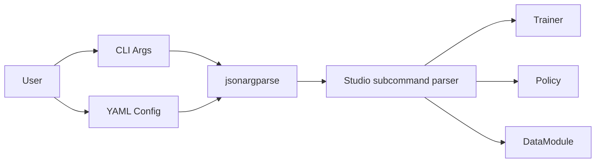

# CLI Design

Command-line interface built on jsonargparse and the shared `physicalai` host.

## Components

- Runtime-owned `physicalai` console script
- Studio subcommand entry points in `physicalai.cli.subcommands`
- YAML/JSON config files with CLI overrides
- Export commands backed by the policy `export()` contract
- Type validation from type hints
- Dynamic class loading via `class_path`

## Usage

```bash
# Train with config
physicalai fit --config configs/train.yaml

# Override parameters
physicalai fit --config configs/train.yaml --trainer.max_epochs 200

# Print config
physicalai fit --print_config
```

## Architecture


