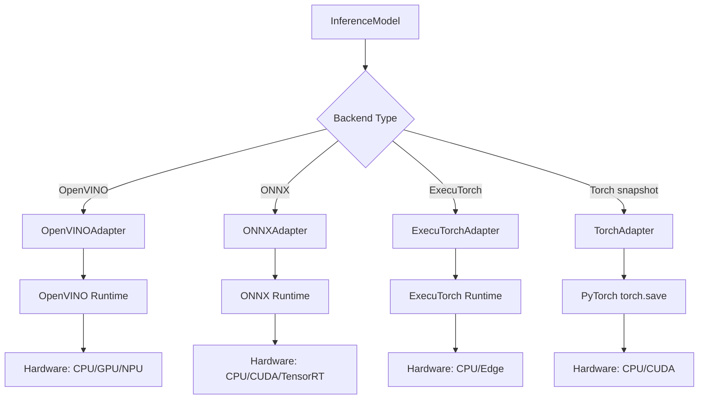
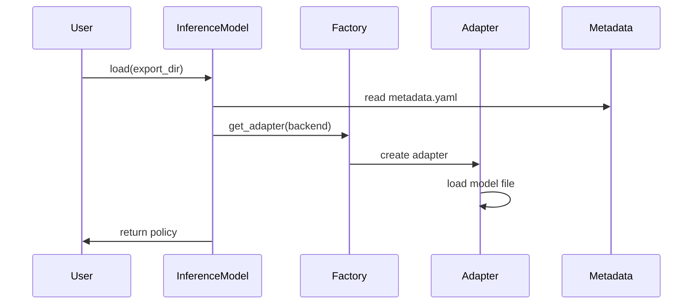
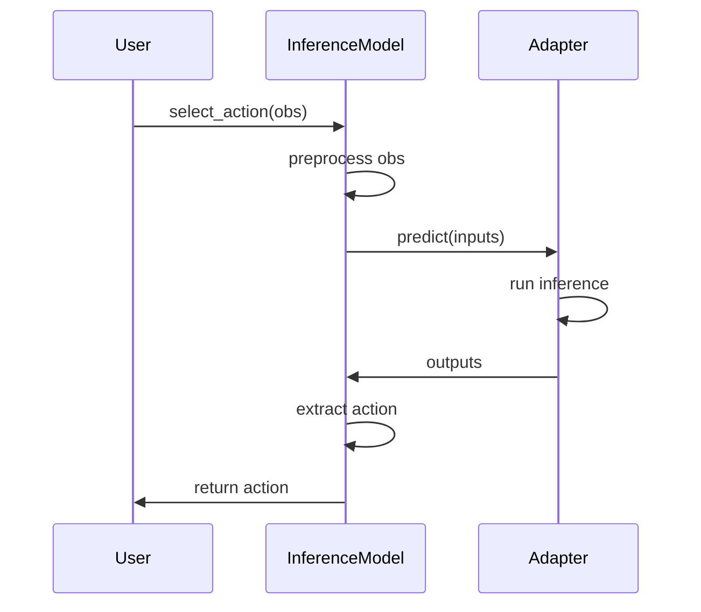
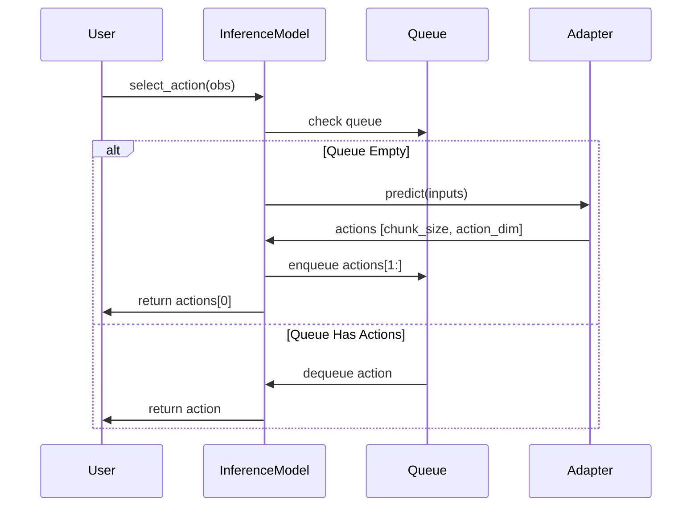

# Inference System

Production inference with multiple backends.

## Features

- Unified API matching training policies
- Multiple backends (OpenVINO, ONNX, Torch, ExecuTorch)
- Auto-detection of backend and device
- Action queuing for chunked policies

## RuntimeAdapter

Common interface for backends:

```python test="skip" reason="interface definition, not executable"
class RuntimeAdapter(ABC):
    @abstractmethod
    def load(self, model_path: Path) -> None: ...

    @abstractmethod
    def predict(
        self, inputs: dict[str, np.ndarray]
    ) -> dict[str, np.ndarray]: ...
```

## Adapters

| Adapter               | Hardware       |
| --------------------- | -------------- |
| **OpenVINOAdapter**   | Intel CPU/GPU  |
| **ONNXAdapter**       | Cross-platform |
| **ExecuTorchAdapter** | Edge/mobile    |
| **TorchAdapter**      | CPU/GPU        |

## InferenceModel

High-level interface:

```python test="skip" reason="requires exported model"
policy = InferenceModel("./exports")  # Auto-detects backend
policy.reset()
action = policy.select_action(observation)
```

## Architecture



### Factory Pattern

```python test="skip" reason="requires physicalai install and model"
from physicalai.inference.adapters import get_adapter

adapter = get_adapter(ExportBackend.OPENVINO)
adapter.load(model_path)
```

### Metadata Configuration

Configuration loaded from `metadata.yaml`:

```yaml
backend: openvino
policy_class: physicalai.policies.act.policy.ACT
chunk_size: 100
use_action_queue: true
input_shapes: { image: [3, 224, 224], state: [14] }
output_shapes: { action: [7] }
```

## Data Flow

### 1. Loading



### 2. Inference (No Queue)



### 3. Inference (With Action Queue)



## Action Queuing

For chunked policies (`chunk_size > 1`), automatically manages action queue:

```python test="skip" reason="requires exported model"
policy = InferenceModel("./exports")  # chunk_size=100
policy.reset()

action_0 = policy.select_action(obs_0)    # Runs model, queues 99 actions
action_1 = policy.select_action(obs_1)    # From queue
# ... 98 more from queue ...
action_100 = policy.select_action(obs_100)  # Runs model again
```

**Benefits:** Reduces inference calls by `chunk_size`, matches training behavior

## Real-time Chunking

Plain action queuing drains a chunk to empty before predicting the next one, so
the robot stalls (or jerks) at every chunk boundary while inference runs.
Real-Time Chunking (RTC) removes that seam: inference for chunk _N+1_ runs in the
background **while** chunk _N_ is still executing, and the new chunk is denoised
under a constraint that pins its beginning to the actions the robot is already
committed to.

Supported by the flow-matching policies (`Pi05`, `SmolVLA`). RTC must be enabled
on the policy _before_ export, because it changes the traced input schema — see
[Export Design](../export/README.md#export-with-real-time-chunking-rtc).

### Principle

Denoising starts from noise and integrates a velocity field down to a clean
action chunk. RTC biases that integration at every step towards the unconsumed
tail of the previous chunk:

1. The unconsumed tail of chunk _N_ is passed in as `prev_chunk_left_over`.
2. At each denoising step, the model predicts clean actions
   $\hat{x}_1 = x_t - t\,v_t$ and compares them against that tail.
3. The error is weighted per action index by a **prefix weight** ramp, so early
   actions (which the robot will execute first, or has already committed to) are
   pulled hard toward the previous chunk, while later actions are left free to
   react to the new observation.
4. The weighted error is subtracted from the velocity, scaled by an adaptive
   guidance weight that is clamped by `max_guidance_weight`.

The result: consecutive chunks agree on their overlap, so actions can be swapped
mid-flight without a discontinuity.

| Model input            | Shape                      | dtype     | Meaning                                            |
| ---------------------- | -------------------------- | --------- | -------------------------------------------------- |
| `prev_chunk_left_over` | `(chunk_size, action_dim)` | `float32` | Unconsumed tail of the previous chunk, zero-padded |
| `inference_delay`      | `()`                       | `int64`   | Actions the robot consumes while inference runs    |
| `execution_horizon`    | `()`                       | `int64`   | Fresh actions taken from each chunk before re-plan |
| `max_guidance_weight`  | `()`                       | `float32` | Upper bound on the guidance strength               |

### Execution horizon and prefix weights

`execution_horizon` ($H$) is how many actions the runtime intends to execute from
each chunk before re-planning. `inference_delay` ($d$) is how many actions the
robot will consume while the next inference is still running, derived from
measured latency:

$$d = \lceil \text{max latency}_s \cdot \text{fps} \rceil$$

Together they define the prefix weight for action index $i$ in the chunk:

$$w_i = \mathrm{clamp}\!\left(\frac{H - i}{H - \min(d, H) + 1},\; 0,\; 1\right)$$

Reading it off:

- Actions before index $\min(d, H)$ get $w_i = 1$ — fully frozen, because the
  robot is already committed to executing them.
- Weights ramp down linearly between $\min(d, H)$ and $H$ — the region that is
  blended.
- Actions past $H$ get $w_i = 0$ — fully free to follow the new observation.

So `execution_horizon` directly sets **how much of the new chunk overlaps the old
one**. Raising it produces smoother, more open-loop motion and fewer inferences
per second; lowering it makes the policy more reactive at the cost of more model
calls. An `exp` schedule is also available, which decays the ramp faster than
linear and so releases the blended region sooner. In current implementation,
`execution_horizon <= chunk_size / 2`. That constraint allows to ensure that
chunks have significant share of meaningful overlapping during RTC inference
avoiding the situation of overusing the unreliable end of chunk.

### Simplest RTC inference

To run RTC inference, inference runtime package is required.

```python test="skip" reason="requires exported RTC model and a robot loop"
from physicalai.inference import InferenceModel
from physicalai.inference.callbacks import RTCLatencyTracker
from physicalai.runtime import RTCActionQueue, RTCExecution

FPS = 30.0

latency_tracker = RTCLatencyTracker()
model = InferenceModel("./exports/pi05_rtc", callbacks=[latency_tracker])

execution = RTCExecution(
    fps=FPS,
    execution_horizon=15,      # fresh actions per chunk before re-planning
    max_guidance_weight=5.0,   # how tightly chunks are pinned to each other
    latency_tracker=latency_tracker,
)
queue = RTCActionQueue()

execution.start(model, queue)
execution.warmup(sample_observation)  # blocks until the first chunk is ready

try:
    while running:
        observation = robot.get_observation()
        execution.maybe_request(observation)  # non-blocking; infers in background
        action = queue.pop()                  # one action per control tick
        if action is not None:
            robot.send_action(action)
finally:
    execution.stop()
```

`execution_horizon = 15` and `max_guidance_weight = 5` are the defaults validated
on π0.5 at 30 fps. If chunk seams look discontinuous, raise
`max_guidance_weight`; if you see jitter or oscillation between chunks, lower it.

## Backend & Device Selection

### Auto-Detection

Backend detected from file extensions:

- `.xml` → OpenVINO
- `.onnx` → ONNX
- `.pte` → ExecuTorch

### Device Priority

| Backend    | Device Priority       |
| ---------- | --------------------- |
| OpenVINO   | GPU → NPU → CPU       |
| ONNX       | CUDA → TensorRT → CPU |
| ExecuTorch | CPU (edge devices)    |
| Torch      | cuda → CPU            |

## Performance

### Optimization

- Action queuing amortizes cost over `chunk_size`
- Model caching (OpenVINO)
- Execution provider selection (ONNX)
- Batch processing (future)

## Error Handling

Common errors: `ImportError` (backend not installed), `ValueError`
(invalid export), `RuntimeError` (shape mismatch)

## Testing

- **Unit tests**: Each adapter (load, predict, properties)
- **Integration tests**: Train → export → inference pipeline
- **Compatibility tests**: Backend consistency validation

**Testing Plan:**

- OpenVINO, ONNX: Fully tested with ACT policy
- ExecuTorch: Tested with mocked executorch runtime

## Extension Points

- **Custom Adapters**: Implement `RuntimeAdapter` for new backends
- **Custom Preprocessing**: Override `_preprocess_observation()` in
  `InferenceModel`

## Future Work

- INT8 quantization support
- Batch inference
- Streaming inference
- Model serving (REST/gRPC)

## See Also

- [Export Design](../export/README.md) - How models are exported
- [Policy Design](../policy/overview.md) - Policy architecture
- [Export & Inference Guide](../../guides/export_inference.md) - Usage examples
