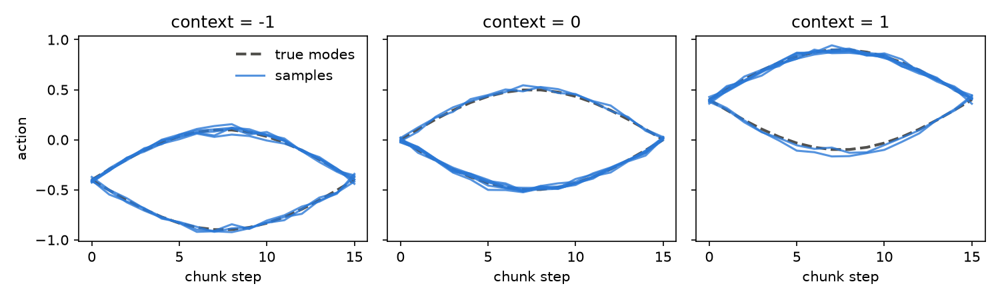

# Diffusion Action Head

`DiffusionActionHead` is an `IterativeActionHead` for denoising diffusion
(DDPM / DDIM). It implements `timesteps`, `step` and `compute_loss`; a
subclass only writes `denoise`. See the
[explanation](../../../../../../docs/explanation/policy/action_head.md#diffusion-action-head) for how it works.

```python
from physicalai.policies.components import DiffusionActionHead
```

| Argument                 | Default               | Meaning                                               |
| ------------------------ | --------------------- | ----------------------------------------------------- |
| `num_train_timesteps`    | `100`                 | Forward diffusion steps `T`                           |
| `num_inference_steps`    | `T`                   | Sampling steps, evenly spaced (`"leading"` spacing)   |
| `beta_schedule`          | `"squaredcos_cap_v2"` | Noise schedule                                        |
| `beta_start`, `beta_end` | `1e-4`, `0.02`        | Range of the linear schedules                         |
| `prediction_type`        | `"epsilon"`           | `denoise` predicts the noise, or `"sample"` for $x_0$ |
| `clip_sample`            | `True`                | Clamp $\hat x_0$ at every step                        |
| `clip_sample_range`      | `1.0`                 | Clamp bound, matching the action normalization        |
| `eta`                    | `1.0`                 | `1.0` is DDPM, `0.0` is DDIM                          |
| `use_random_input_noise` | `True`                | Start from Gaussian noise, else from zeros            |

The code blocks below form one script: run them in order in one Python
session. Plotting needs `matplotlib`. Results were measured on an NVIDIA
A100 and one thread of an Intel Xeon Gold 6338 (`OMP_NUM_THREADS=1`), with
PyTorch 2.11. [Graph replay](#graph-replay) was also measured on an Intel Arc
B390 GPU (XPU) with PyTorch 2.11.

## A Tiny Diffusion Head

### Define

The head flattens the chunk and predicts its noise with a 3-layer MLP. A real
policy uses its own denoiser, such as a conditional 1D U-Net or a transformer.

```python
import torch
from torch import nn

from physicalai.policies.components.action_heads import Context, DiffusionActionHead


class TinyDiffusionHead(DiffusionActionHead):
    """Predicts the noise of a whole chunk with a 3-layer MLP."""

    def __init__(self, chunk_size: int = 16, action_dim: int = 1, hidden: int = 256, **kwargs) -> None:
        super().__init__(chunk_size, action_dim, **kwargs)
        self.net = nn.Sequential(
            nn.Linear(chunk_size * action_dim + 2, hidden),
            nn.SiLU(),
            nn.Linear(hidden, hidden),
            nn.SiLU(),
            nn.Linear(hidden, chunk_size * action_dim),
        )

    def denoise(self, x_t: torch.Tensor, t: torch.Tensor, context: Context) -> torch.Tensor:
        time = (t.float() / self.num_train_timesteps).to(x_t.dtype)[:, None]  # scale in fp32, see "Dtypes"
        features = torch.cat([x_t.flatten(1), context["tokens"][:, 0], time], dim=-1)
        return self.net(features).view_as(x_t)
```

### Train

Each demonstration is a chunk of 16 one-dimensional actions. The context
shifts the chunk up or down, and a coin flip decides whether its bump goes up
or down, so every context has two correct answers:

```python
device = torch.accelerator.current_accelerator() if torch.accelerator.is_available() else torch.device("cpu")
steps = torch.linspace(0, 1, 16, device=device)


def demonstrations(phase: torch.Tensor) -> torch.Tensor:
    """Chunks shifted by the context, with a bump that goes up or down at random."""
    direction = torch.randint(0, 2, phase.shape, device=device) * 2 - 1
    return (0.4 * phase + 0.5 * direction * torch.sin(torch.pi * steps))[..., None]  # (B, 16, 1)


torch.manual_seed(0)
head = TinyDiffusionHead().to(device)
optimizer = torch.optim.AdamW(head.parameters(), lr=1e-3)

for _ in range(3000):
    phase = torch.rand(256, 1, device=device) * 2 - 1
    loss = head.compute_loss(demonstrations(phase), {"tokens": phase[:, None]}).mean()
    optimizer.zero_grad()
    loss.backward()
    optimizer.step()
```

### Check the predictions

Sample 8 chunks for three contexts and plot them over the two true modes:

```python
import matplotlib.pyplot as plt

head.eval()
fig, axes = plt.subplots(1, 3, figsize=(10, 3), sharey=True)
with torch.inference_mode():
    for ax, value in zip(axes, (-1.0, 0.0, 1.0)):
        phase = torch.full((1, 1), value, device=device)
        for direction in (1, -1):  # the two true modes
            truth = 0.4 * value + 0.5 * direction * torch.sin(torch.pi * steps)
            ax.plot(truth.cpu(), color="#52514e", linestyle="--", linewidth=2)
        samples = head.sample({"tokens": phase.expand(8, 1)[:, None]})  # 8 samples, one context
        ax.plot(samples[..., 0].T.cpu(), color="#2a78d6", linewidth=1.5, alpha=0.8)
        ax.set_title(f"context = {value:g}")
        ax.set_xlabel("chunk step")
axes[0].set_ylabel("action")
axes[0].legend(axes[0].lines[1:3], ["true modes", "samples"], frameon=False)
fig.tight_layout()
fig.savefig("diffusion_head_samples.png", dpi=150)
```



The samples follow the context and split between both modes. On 512 random
contexts the mean distance to the nearest mode is 0.02, and 49% of samples
take the upper mode. A regression head would predict the average, a flat line
that matches neither.

## Timings

### Sampling steps

```python
import time


def latency_ms(fn, repeats: int = 200) -> float:
    """Median wall time of ``fn()`` in milliseconds, after a warm-up call."""
    fn()
    times = []
    for _ in range(repeats):
        if device.type != "cpu":
            torch.accelerator.synchronize()
        start = time.perf_counter()
        fn()
        if device.type != "cpu":
            torch.accelerator.synchronize()
        times.append((time.perf_counter() - start) * 1e3)
    return sorted(times)[len(times) // 2]


context = {"tokens": torch.zeros(1, 1, 1, device=device)}
with torch.inference_mode():
    for name, num_steps, eta in [("DDPM", 100, 1.0), ("DDIM", 10, 0.0)]:
        head.eta = eta
        print(f"{name} {num_steps:3d} steps: {latency_ms(lambda: head.sample(context, num_steps=num_steps)):.2f} ms")
```

| Sampler | Steps | A100    | CPU, 1 thread |
| ------- | ----- | ------- | ------------- |
| DDPM    | 100   | 42.6 ms | 18.3 ms       |
| DDIM    | 10    | 4.1 ms  | 1.8 ms        |

DDIM with 10 steps is about 10x faster than DDPM with 100, and `num_steps`
can change per call without retraining. The A100 is slower than one CPU
thread because each step launches dozens of tiny kernels. [Graph
replay](#graph-replay) removes that overhead.

### Dtypes

Compare the deterministic DDIM sampler in each dtype against float32, on 64
contexts:

```python
import copy

head.eta, head.use_random_input_noise = 0.0, False  # deterministic DDIM, so dtypes compare exactly
phase = torch.linspace(-1, 1, 64, device=device)[:, None, None]
with torch.inference_mode():
    reference = head.sample({"tokens": phase}, num_steps=10)
    for dtype in (torch.float32, torch.bfloat16, torch.float16):
        low = copy.deepcopy(head).to(dtype)  # a copy, so the float32 head is never rounded
        context = {"tokens": phase.to(dtype)}
        actions = low.sample(context, num_steps=10)
        error = (actions.float() - reference).abs()
        ms = latency_ms(lambda: low.sample(context, num_steps=10))
        print(f"{dtype}: {ms:.2f} ms, mean error {error.mean():.4f}, max error {error.max():.4f}")
```

| Dtype    | A100   | A100 mean / max error | CPU     | CPU mean / max error |
| -------- | ------ | --------------------- | ------- | -------------------- |
| float32  | 4.1 ms | 0 / 0                 | 2.9 ms  | 0 / 0                |
| bfloat16 | 4.2 ms | 0.0034 / 0.051        | 6.2 ms  | 0.0050 / 0.045       |
| float16  | 4.5 ms | 0.0003 / 0.0045       | 13.9 ms | 0.0004 / 0.0035      |

The whole head runs in the cast dtype: the network, the schedule buffers and
`step`, with no promotion to float32. float16 keeps 10 mantissa bits to
bf16's 7, so it is about 10x more accurate here. Low precision does not speed
up a model this small: the A100 is launch-bound and this CPU has no native
bf16 or fp16 units. The [explanation](../../../../../../docs/explanation/policy/action_head.md#dtypes)
covers what the head does so low precision stays safe.

## Graph Replay

`enable_graph_replay()` captures `sample` in a CUDA or XPU graph, chosen from
the context's device. It replays only in `eval()` mode with gradients
disabled:

```python
head = head.to(device).eval()
head.eta, head.use_random_input_noise = 0.0, False
context = {"tokens": torch.full((1, 1, 1), 0.5, device=device)}
with torch.inference_mode():
    for num_steps in (1, 10, 100):
        head.enable_graph_replay(False)
        eager = latency_ms(lambda: head.sample(context, num_steps=num_steps))
        head.enable_graph_replay()  # the first call below captures, later calls replay
        replayed = latency_ms(lambda: head.sample(context, num_steps=num_steps))
        print(f"{num_steps:3d} steps: eager {eager:6.2f} ms, graph {replayed:5.2f} ms, {eager / replayed:4.1f}x")
```

| Steps | A100 eager | CUDA graph | Speedup | Arc B390 eager | XPU graph | Speedup |
| ----- | ---------- | ---------- | ------- | -------------- | --------- | ------- |
| 1     | 0.49 ms    | 0.12 ms    | 4.0x    | 0.35 ms        | 0.11 ms   | 3.2x    |
| 10    | 4.11 ms    | 0.65 ms    | 6.3x    | 2.53 ms        | 0.57 ms   | 4.4x    |
| 100   | 40.4 ms    | 6.28 ms    | 6.4x    | 23.7 ms        | 5.39 ms   | 4.4x    |

The first call for each shape and step count captures the graph. On the Arc
B390 the replayed actions match eager sampling exactly.
